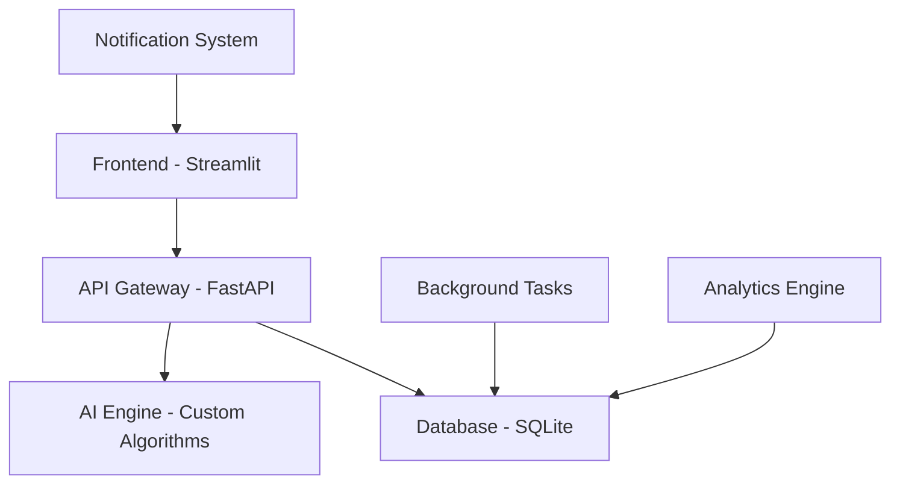

# I'm Beside You - AI-Powered Mindfulness & Productivity Companion

> **An intelligent mindfulness and productivity application that combines AI-driven insights with evidence-based wellness practices to help users build better habits, maintain focus, and cultivate mental well-being.**

## **Developer Information**

**Name:** Harsh Sahu  
**University:** Indian Institute of Technology (IIT) Kharagpur  
**Department:** Chemistry  
**Project:** AI Agent Prototype Assignment  

---

[](https://streamlit.io/)
[](https://fastapi.tiangolo.com/)
[](https://python.org/)
[](https://sqlite.org/)

---

## 🎯 Problem Statement & Solution Approach

### **The Problem We're Solving**

In today's fast-paced digital world, people struggle with:
- **Digital Overwhelm**: Constant notifications and distractions affecting focus
- **Mental Health Crisis**: Rising anxiety and stress levels, especially among students and professionals
- **Habit Formation Challenges**: Difficulty building and maintaining positive habits
- **Lack of Mindfulness**: Disconnection from present-moment awareness
- **Creativity Blocks**: Limited outlets for self-expression and reflection

### **Our Innovative Solution**

**I'm Beside You** is an AI-powered companion that addresses these challenges through:

1. **AI-Driven Personalization**: Intelligent recommendations based on user behavior and preferences
2. **Holistic Approach**: Integrating productivity, mindfulness, creativity, and habit formation
3. **Data-Driven Insights**: Analytics to track progress and identify patterns
4. **Creative Expression**: Digital journaling with rich formatting and drawing capabilities
5. **Evidence-Based Practices**: Incorporating proven mindfulness and productivity techniques

---

## Key Features & Demonstrations

### **Smart Dashboard - Your Progress at a Glance**


**Features:**
- Real-time progress tracking across all activities
- AI-generated insights and recommendations
- Synthetic data visualization for demonstration
- Streak tracking and goal achievement metrics
- Personalized daily summary and motivation

### **Focus Timer - Pomodoro with Tree Growth Gamification**


**Innovation:**
- **Gamified Experience**: Watch virtual trees grow as you focus
- **AI-Powered Break Suggestions**: Intelligent break timing based on productivity patterns
- **Target Management**: Set and track daily focus goals
- **Progress Visualization**: Real-time progress bars and achievement celebrations
- **Session Analytics**: Track focus patterns over time

### **Intelligent Habit Tracker - Beyond Simple Checkboxes**


**Advanced Features:**
- **Category-Based Organization**: Visual icons and color coding
- **Streak Analytics**: Advanced streak calculation and motivation
- **Smart Reminders**: AI-powered timing for habit reinforcement
- **Progress Visualization**: Interactive cards with completion tracking
- **Habit Insights**: Pattern recognition and improvement suggestions

### **Meditation & Mindfulness - Guided Wellness Journey**


**Unique Approach:**
- **Dynamic Quote System**: Contextual motivational quotes
- **Session Customization**: Flexible duration and practice types
- **Mood Tracking**: Pre and post-session emotional state monitoring
- **Reflection Journal**: Optional guided reflection prompts
- **Progress Analytics**: Mindfulness streak and session insights

### ✨ **Creative Canvas - Digital Journal with Rich Features**


**Professional Features:**
- **Rich Text Editor**: Full formatting capabilities (bold, italic, highlight, colors)
- **Drawing Tools**: Multiple brush types, colors, and canvas backgrounds
- **Entry Templates**: Specialized layouts for journals, poems, stories, memories
- **Media Integration**: Image upload and embedding capabilities
- **Smart Organization**: Automatic categorization and searchable archives
- **Export Options**: Multiple format support for sharing and backup

---

## 🚀 Quick Start Guide

### **Prerequisites**
- Python 3.8 or higher
- Git (for cloning the repository)
- Virtual environment support (venv or conda)

### **Installation Steps**

1. **Clone the Repository**
   ```bash
   git clone <repository-url>
   cd "I'm Beside You Assignment"
   ```

2. **Set Up Virtual Environment**
   ```bash
   # Create virtual environment
   python -m venv venv_frontend
   
   # Activate virtual environment
   # On Windows:
   venv_frontend\Scripts\activate
   # On macOS/Linux:
   source venv_frontend/bin/activate
   ```

3. **Install Dependencies**
   ```bash
   # Option 1: Use setup script (Windows)
   setup.bat
   
   # Option 2: Manual installation
   # Install backend dependencies
   pip install -r backend/requirements.txt
   
   # Install frontend dependencies
   pip install -r frontend/requirements.txt
   ```

4. **Initialize Database**
   ```bash
   # The database will be automatically created when you first run the backend
   ```

5. **Start the Application**
   ```bash
   # Option 1: Use startup script (Windows)
   start_app.bat
   
   # Option 2: Use Python startup script (Cross-platform)
   python start_app.py
   
   # Option 3: Manual startup
   # Terminal 1: Start Backend API
   cd backend
   python main.py
   
   # Terminal 2: Start Frontend (in a new terminal)
   cd frontend
   streamlit run app.py
   ```

6. **Access the Application**
   - Frontend: http://localhost:8501
   - Backend API: http://localhost:8000
   - API Documentation: http://localhost:8000/docs

### **Project Structure**
```
I'm Beside You Assignment/
├── backend/                 # FastAPI backend application
│   ├── app/                # Application modules
│   │   └── routes/         # API route handlers
│   ├── main.py            # Backend entry point
│   └── requirements.txt    # Backend dependencies
├── frontend/               # Streamlit frontend application
│   ├── app.py             # Frontend entry point
│   └── requirements.txt    # Frontend dependencies
├── data/                  # Database and sample data
│   ├── mindful_app.db     # SQLite database
│   ├── sample_*.json      # Demo data files
│   └── training/          # AI training datasets
├── venv_frontend/         # Virtual environment
├── config.json           # Application configuration
├── setup.bat             # Windows setup script
├── start_app.bat         # Windows startup script  
├── start_app.py          # Cross-platform startup script
├── .gitignore            # Git ignore rules
└── README.md             # Project documentation
```

---

## Technical Architecture

### **System Design Philosophy**



**Key Technical Decisions:**

1. **Frontend: Streamlit**
   - Rapid prototyping and deployment
   - Rich interactive components
   - Easy integration with Python backend
   - Real-time updates and responsiveness

2. **Backend: FastAPI**
   - High-performance async API
   - Automatic API documentation
   - Type validation and serialization
   - Easy integration with ML models

3. **Database: SQLite**
   - Lightweight and portable
   - ACID compliance for data integrity
   - Perfect for single-user applications
   - Easy backup and migration

### **Project Structure**

```
I'm Beside You Assignment/
├── frontend/                 # Streamlit web application
│   ├── app.py                   # Main application entry point
│   └── requirements.txt         # Frontend dependencies
├── backend/                  # FastAPI server
│   ├── app/
│   │   └── routes/             # API endpoint modules
│   │       ├── habits.py       # Habit tracking endpoints
│   │       ├── focus.py        # Focus timer endpoints
│   │       ├── meditation.py   # Meditation session endpoints
│   │       └── creativity.py   # Creative canvas endpoints
│   ├── main.py                 # FastAPI application setup
│   └── requirements.txt        # Backend dependencies
├── agents/                  # AI and automation modules
│   ├── habit_tracker.py        # Intelligent habit recommendations
│   ├── study_timer.py          # Focus session optimization
│   ├── meditation.py           # Mindfulness session guidance
│   └── creativity.py           # Creative prompt generation
├── data/                    # Database and data storage
│   └── mindful_app.db          # SQLite database
├── models/                  # AI model storage
├── logs/                    # Application logs
└── deployment/              # Quick start scripts
    ├── start_backend.bat       # Windows backend launcher
    └── start_frontend.bat      # Windows frontend launcher
```

---

## 🚀 Quick Start Guide

### **Prerequisites**
- Python 3.8 or higher
- Git (for cloning the repository)
- 4GB RAM (recommended)
- Modern web browser

### **One-Command Setup** (Windows)

```bash
# Clone the repository
git clone https://github.com/Harsh7645/IBY_Assignment_Harsh_Sahu.git
cd IBY_Assignment_Harsh_Sahu

# Start the complete application
./start_enhanced_app.bat
```

### **Manual Setup**

#### **Backend Setup**
```bash
# Navigate to backend directory
cd backend

# Create virtual environment
python -m venv venv
venv\Scripts\activate  # Windows
source venv/bin/activate  # macOS/Linux

# Install dependencies
pip install -r requirements.txt

# Initialize database
python ../init_db.py

# Start FastAPI server
uvicorn main:app --reload --host 0.0.0.0 --port 8000
```

#### **Frontend Setup**
```bash
# Open new terminal and navigate to frontend
cd frontend

# Create virtual environment
python -m venv venv_frontend
venv_frontend\Scripts\activate  # Windows
source venv_frontend/bin/activate  # macOS/Linux

# Install dependencies
pip install -r requirements.txt

# Start Streamlit application
streamlit run app.py --server.port 8501
```

### **Access Points**
- **Web Application**: http://localhost:8501
- **API Documentation**: http://localhost:8000/docs
- **Alternative API Docs**: http://localhost:8000/redoc

---

## AI & Intelligence Features

### **Smart Recommendations**
- **Habit Suggestions**: Based on user patterns and success rates
- **Focus Session Timing**: Optimal work-break cycles personalized to user
- **Meditation Guidance**: Tailored practices based on stress levels and preferences
- **Creative Prompts**: AI-generated journal prompts and inspiration

### **Predictive Analytics**
- **Streak Prediction**: Likelihood of maintaining habit streaks
- **Productivity Forecasting**: Best times for focus sessions
- **Mood Pattern Recognition**: Identifying triggers and positive interventions
- **Progress Optimization**: Suggestions for improving consistency and results

---

## Future Roadmap

### **Phase 1: Core Enhancement** (Current)
- Complete UI/UX implementation
- Basic AI recommendations
- Data persistence and analytics
- Responsive design

### **Phase 2: Advanced AI** (Next 3 months)
- Machine learning model integration
- Natural language processing for journal analysis
- Personalized meditation guide creation
- Advanced habit success prediction

### **Phase 3: Social & Collaboration** (Next 6 months)
- Community features and challenges
- Mentor-mentee connections
- Group meditation sessions
- Achievement sharing and motivation

### **Phase 4: Enterprise Integration** (Next 12 months)
- Workplace wellness modules
- Team productivity analytics
- Integration with popular productivity tools
- Corporate mindfulness programs

---

## Development & Contribution

### **Technology Stack**
- **Frontend**: Streamlit, HTML/CSS, JavaScript
- **Backend**: FastAPI, Python 3.8+
- **Database**: SQLite (development), PostgreSQL (production-ready)
- **AI/ML**: scikit-learn, TensorFlow/PyTorch
- **Deployment**: Docker, GitHub Actions, Vercel/Heroku

---

## Performance & Analytics

### **Key Metrics Tracked**
- **User Engagement**: Session duration, feature usage, return rate
- **Productivity Metrics**: Focus session completion, goal achievement
- **Wellness Indicators**: Meditation consistency, mood improvements
- **Habit Success**: Completion rates, streak lengths, pattern analysis

### **Data Privacy & Security**
- **Local-First Approach**: Data stored locally by default
- **Encryption**: All sensitive data encrypted at rest
- **Anonymization**: Analytics data anonymized for insights
- **User Control**: Complete data export and deletion capabilities

---

</div>
